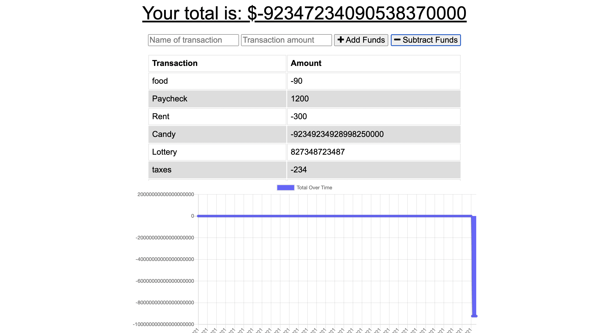

# Progressive Budget

## Table of Contents
[Project Link](#Link)  
[Technologies](#Technologies)  
[Description](#Description)  
[Screenshots](#Screenshots)  
[License](#License)  
[Contact](#Contact)

## Link
https://damp-inlet-03430.herokuapp.com/

## Technologies
HTML and CSS, Javascript, Node.js, Babel, Compression, Concurrently, Express.js, Lite-Server, Mongoose, Morgan

## Description
A budget tracker webpage that allows the user to add deposits and expenses to a database in order to keep track of their expenses. The user simply enters in a name and dollar amount, and then chooses whether to add or subtract this amount from their total budget. The webpage allows the user to enter information when offline, and the inputed information is added to the database once online again.

## Screenshots

## License
MIT

## Contact
Dalton Wilkins - daltongh@gmail.com
